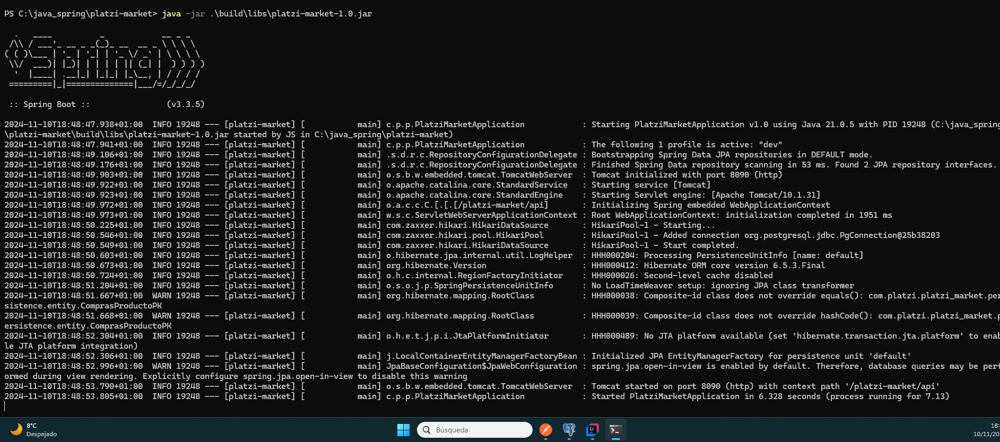
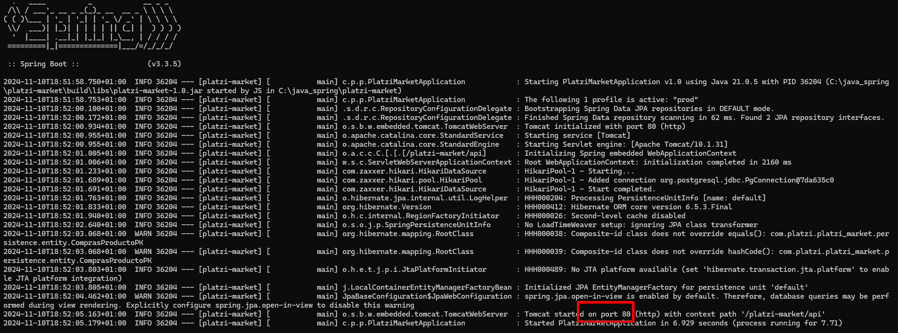

# CONF BASICA

1. Para iniciar el proyecto, hay que conectar con la bdd de postgre y poner la configuracion en maven primero.

2. Cambiar la configuracion de bdd postgre en:
   ```sql
    C:\Program Files\PostgreSQL\17\data\pg_hba.conf
    ```
    Hay que activar el host porque sino no funciona y reiniciar el server.
   ```sql
    C:\Program Files\PostgreSQL\17\data\pg_hba.conf
    ```


3. 


4. Documentacion con la API swagger
   - http://localhost:8090/platzi-market/api/swagger-ui/index.html


5. Montar aplicarcion final:

- Entrar en la carpeta del proyecto y poner el comando 
  - PS C:\java_spring\platzi-market> java -jar .\build\libs\platzi-market-1.0.jar
  - java -jar .\build\libs\platzi-market-1.0.jar



- Ya estaria corriendo, tambien puedo poner el modo dev o el prod.
- Poner el modo Prod que va en el puerto 80 ejecutando el comando
  ```
  java -jar "-Dspring.profiles.active=prod" .\build\libs\platzi-market-1.0.jar
  ```



- Corriendo en prod la url seria:
  - http://localhost/platzi-market/api/swagger-ui/index.html